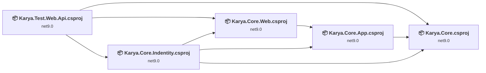
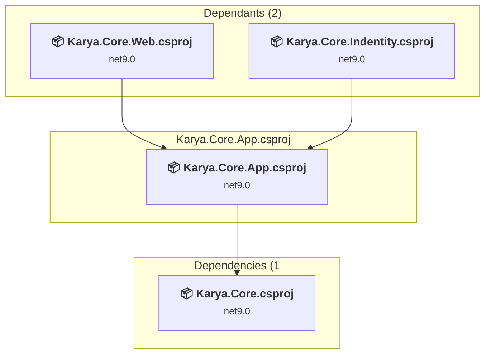
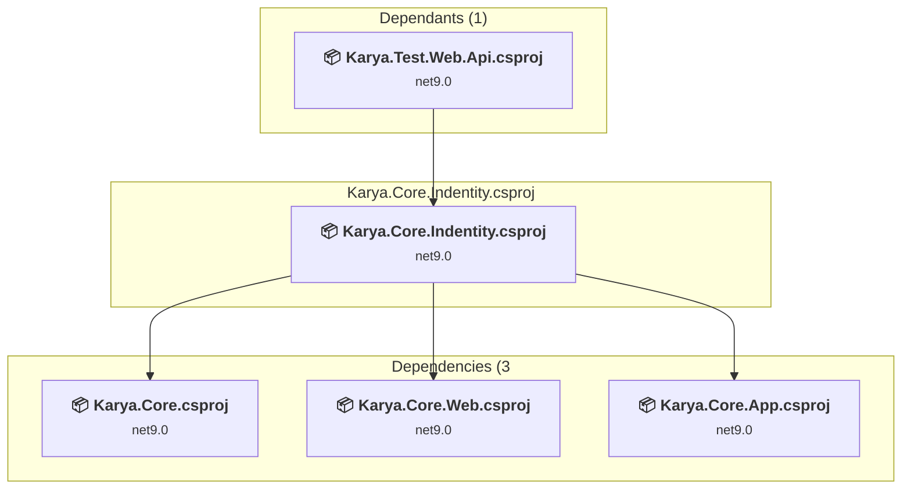
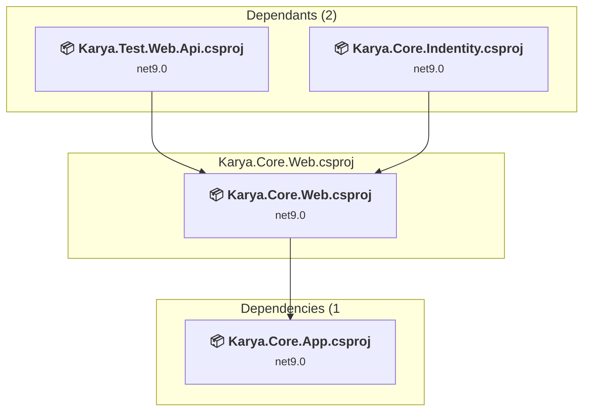
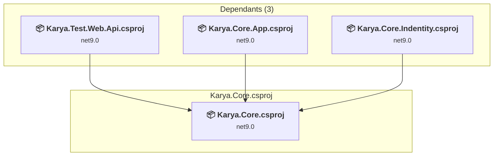
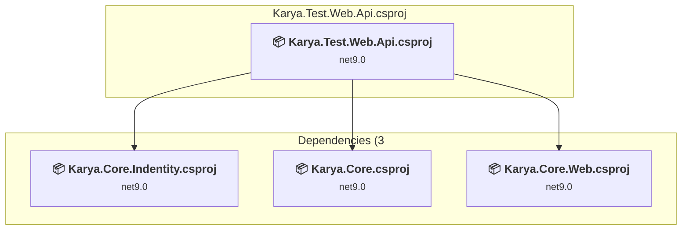

# Projects and dependencies analysis

This document provides a comprehensive overview of the projects and their dependencies in the context of upgrading to .NETCoreApp,Version=v10.0.

## Table of Contents

- [Executive Summary](#executive-Summary)
  - [Highlevel Metrics](#highlevel-metrics)
  - [Projects Compatibility](#projects-compatibility)
  - [Package Compatibility](#package-compatibility)
  - [API Compatibility](#api-compatibility)
  - [Binding Redirect Configuration](#binding-redirect-configuration)
- [Aggregate NuGet packages details](#aggregate-nuget-packages-details)
- [Top API Migration Challenges](#top-api-migration-challenges)
  - [Technologies and Features](#technologies-and-features)
  - [Most Frequent API Issues](#most-frequent-api-issues)
- [Projects Relationship Graph](#projects-relationship-graph)
- [Project Details](#project-details)

  - [Karya.Core.App\Karya.Core.App.csproj](#karyacoreappkaryacoreappcsproj)
  - [Karya.Core.Indentity\Karya.Core.Indentity.csproj](#karyacoreindentitykaryacoreindentitycsproj)
  - [Karya.Core.Web\Karya.Core.Web.csproj](#karyacorewebkaryacorewebcsproj)
  - [Karya.Core\Karya.Core.csproj](#karyacorekaryacorecsproj)
  - [Karya.Test.Web.Api\Karya.Test.Web.Api.csproj](#karyatestwebapikaryatestwebapicsproj)

## Executive Summary

### Highlevel Metrics

| Metric | Count | Status |
| :--- | :---: | :--- |
| Total Projects | 5 | All require upgrade |
| Total NuGet Packages | 21 | 11 need upgrade |
| Total Code Files | 190 |  |
| Total Code Files with Incidents | 10 |  |
| Total Lines of Code | 9258 |  |
| Total Number of Issues | 33 |  |
| Estimated LOC to modify | 12+ | at least 0.1% of codebase |

### Projects Compatibility

| Project | Target Framework | Difficulty | Package Issues | API Issues | Binding Issues | Est. LOC Impact | Description |
| :--- | :---: | :---: | :---: | :---: | :---: | :---: | :--- |
| [Karya.Core.App\Karya.Core.App.csproj](#karyacoreappkaryacoreappcsproj) | net9.0 | 🟢 Low | 0 | 0 | 0 |  | ClassLibrary, Sdk Style = True |
| [Karya.Core.Indentity\Karya.Core.Indentity.csproj](#karyacoreindentitykaryacoreindentitycsproj) | net9.0 | 🟢 Low | 5 | 5 | 0 | 5+ | ClassLibrary, Sdk Style = True |
| [Karya.Core.Web\Karya.Core.Web.csproj](#karyacorewebkaryacorewebcsproj) | net9.0 | 🟢 Low | 4 | 0 | 0 |  | ClassLibrary, Sdk Style = True |
| [Karya.Core\Karya.Core.csproj](#karyacorekaryacorecsproj) | net9.0 | 🟢 Low | 2 | 1 | 0 | 1+ | ClassLibrary, Sdk Style = True |
| [Karya.Test.Web.Api\Karya.Test.Web.Api.csproj](#karyatestwebapikaryatestwebapicsproj) | net9.0 | 🟢 Low | 5 | 6 | 0 | 6+ | AspNetCore, Sdk Style = True |

### Package Compatibility

| Status | Count | Percentage |
| :--- | :---: | :---: |
| ✅ Compatible | 10 | 47.6% |
| ⚠️ Incompatible | 0 | 0.0% |
| 🔄 Upgrade Recommended | 11 | 52.4% |
| ***Total NuGet Packages*** | ***21*** | ***100%*** |

### API Compatibility

| Category | Count | Impact |
| :--- | :---: | :--- |
| 🔴 Binary Incompatible | 6 | High - Require code changes |
| 🟡 Source Incompatible | 3 | Medium - Needs re-compilation and potential conflicting API error fixing |
| 🔵 Behavioral change | 3 | Low - Behavioral changes that may require testing at runtime |
| ✅ Compatible | 10877 |  |
| ***Total APIs Analyzed*** | ***10889*** |  |

## Aggregate NuGet packages details

| Package | Current Version | Suggested Version | Projects | Description |
| :--- | :---: | :---: | :--- | :--- |
| DevExtreme.AspNet.Data | 5.1.0 |  | [Karya.Core.csproj](#karyacorekaryacorecsproj) [Karya.Test.Web.Api.csproj](#karyatestwebapikaryatestwebapicsproj) | ✅Compatible |
| Mapster | 10.0.7 |  | [Karya.Core.csproj](#karyacorekaryacorecsproj) | ✅Compatible |
| MediatR | 14.1.0 |  | [Karya.Core.App.csproj](#karyacoreappkaryacoreappcsproj) [Karya.Core.Web.csproj](#karyacorewebkaryacorewebcsproj) [Karya.Test.Web.Api.csproj](#karyatestwebapikaryatestwebapicsproj) | ✅Compatible |
| Microsoft.AspNetCore.Authentication.JwtBearer | 9.0.15 | 10.0.10 | [Karya.Test.Web.Api.csproj](#karyatestwebapikaryatestwebapicsproj) | NuGet package upgrade is recommended |
| Microsoft.AspNetCore.Identity.EntityFrameworkCore | 9.0.14 | 10.0.10 | [Karya.Core.Indentity.csproj](#karyacoreindentitykaryacoreindentitycsproj) | NuGet package upgrade is recommended |
| Microsoft.AspNetCore.JsonPatch | 10.0.9 | 10.0.10 | [Karya.Core.Web.csproj](#karyacorewebkaryacorewebcsproj) | NuGet package upgrade is recommended |
| Microsoft.AspNetCore.Mvc.Core | 2.3.9 |  | [Karya.Core.Indentity.csproj](#karyacoreindentitykaryacoreindentitycsproj) [Karya.Core.Web.csproj](#karyacorewebkaryacorewebcsproj) | ✅Compatible |
| Microsoft.AspNetCore.OpenApi | 9.0.14 | 10.0.10 | [Karya.Core.Web.csproj](#karyacorewebkaryacorewebcsproj) [Karya.Test.Web.Api.csproj](#karyatestwebapikaryatestwebapicsproj) | NuGet package upgrade is recommended |
| Microsoft.Data.SqlClient | 5.1.6 |  | [Karya.Core.csproj](#karyacorekaryacorecsproj) | ✅Compatible |
| Microsoft.EntityFrameworkCore | 9.0.14 | 10.0.10 | [Karya.Core.csproj](#karyacorekaryacorecsproj) | NuGet package upgrade is recommended |
| Microsoft.EntityFrameworkCore.Design | 9.0.14 | 10.0.10 | [Karya.Test.Web.Api.csproj](#karyatestwebapikaryatestwebapicsproj) | NuGet package upgrade is recommended |
| Microsoft.EntityFrameworkCore.SqlServer | 9.0.14 | 10.0.10 | [Karya.Test.Web.Api.csproj](#karyatestwebapikaryatestwebapicsproj) | NuGet package upgrade is recommended |
| Microsoft.EntityFrameworkCore.Tools | 9.0.14 | 10.0.10 | [Karya.Test.Web.Api.csproj](#karyatestwebapikaryatestwebapicsproj) | NuGet package upgrade is recommended |
| Newtonsoft.Json | 13.0.3 | 13.0.4 | [Karya.Core.Indentity.csproj](#karyacoreindentitykaryacoreindentitycsproj) | NuGet package upgrade is recommended |
| OpenIddict.AspNetCore | 7.5.0 |  | [Karya.Core.Indentity.csproj](#karyacoreindentitykaryacoreindentitycsproj) | ✅Compatible |
| OpenIddict.EntityFrameworkCore | 7.5.0 |  | [Karya.Core.Indentity.csproj](#karyacoreindentitykaryacoreindentitycsproj) | ✅Compatible |
| Scalar.AspNetCore | 2.9.4 |  | [Karya.Test.Web.Api.csproj](#karyatestwebapikaryatestwebapicsproj) | ✅Compatible |
| System.Formats.Asn1 | 6.0.1 | 10.0.10 | [Karya.Core.csproj](#karyacorekaryacorecsproj) | NuGet package upgrade is recommended |
| System.Reflection.Emit | 4.3.0 |  | [Karya.Core.Indentity.csproj](#karyacoreindentitykaryacoreindentitycsproj) [Karya.Core.Web.csproj](#karyacorewebkaryacorewebcsproj) | NuGet package functionality is included with framework reference |
| System.Reflection.Emit.Lightweight | 4.3.0 |  | [Karya.Core.Indentity.csproj](#karyacoreindentitykaryacoreindentitycsproj) [Karya.Core.Web.csproj](#karyacorewebkaryacorewebcsproj) | NuGet package functionality is included with framework reference |
| System.Security.Cryptography.Xml | 9.0.18 | 10.0.10 | [Karya.Core.Indentity.csproj](#karyacoreindentitykaryacoreindentitycsproj) | NuGet package upgrade is recommended |

## Top API Migration Challenges

### Technologies and Features

| Technology | Issues | Percentage | Migration Path |
| :--- | :---: | :---: | :--- |
| IdentityModel & Claims-based Security | 5 | 41.7% | Windows Identity Foundation (WIF), SAML, and claims-based authentication APIs that have been replaced by modern identity libraries. WIF was the original identity framework for .NET Framework. Migrate to Microsoft.IdentityModel.* packages (modern identity stack). |

### Most Frequent API Issues

| API | Count | Percentage | Category |
| :--- | :---: | :---: | :--- |
| M:System.Text.Json.JsonSerializer.Deserialize(System.String,System.Type,System.Text.Json.JsonSerializerOptions) | 1 | 8.3% | Behavioral Change |
| T:System.Uri | 1 | 8.3% | Behavioral Change |
| M:System.Uri.#ctor(System.String) | 1 | 8.3% | Behavioral Change |
| M:System.TimeSpan.FromDays(System.Int32) | 1 | 8.3% | Source Incompatible |
| T:Microsoft.Extensions.DependencyInjection.IdentityEntityFrameworkBuilderExtensions | 1 | 8.3% | Source Incompatible |
| M:Microsoft.Extensions.DependencyInjection.IdentityEntityFrameworkBuilderExtensions.AddEntityFrameworkStores''1(Microsoft.AspNetCore.Identity.IdentityBuilder) | 1 | 8.3% | Source Incompatible |
| T:System.IdentityModel.Tokens.Jwt.JwtSecurityTokenHandler | 1 | 8.3% | Binary Incompatible |
| M:System.IdentityModel.Tokens.Jwt.JwtSecurityTokenHandler.#ctor | 1 | 8.3% | Binary Incompatible |
| M:System.IdentityModel.Tokens.Jwt.JwtSecurityTokenHandler.WriteToken(Microsoft.IdentityModel.Tokens.SecurityToken) | 1 | 8.3% | Binary Incompatible |
| T:System.IdentityModel.Tokens.Jwt.JwtSecurityToken | 1 | 8.3% | Binary Incompatible |
| M:System.IdentityModel.Tokens.Jwt.JwtSecurityToken.#ctor(System.String,System.String,System.Collections.Generic.IEnumerable{System.Security.Claims.Claim},System.Nullable{System.DateTime},System.Nullable{System.DateTime},Microsoft.IdentityModel.Tokens.SigningCredentials) | 1 | 8.3% | Binary Incompatible |
| M:Microsoft.Extensions.Configuration.ConfigurationBinder.Get''1(Microsoft.Extensions.Configuration.IConfiguration) | 1 | 8.3% | Binary Incompatible |

## Projects Relationship Graph

Legend:
📦 SDK-style project
⚙️ Classic project

## Project Details

### Karya.Core.App\Karya.Core.App.csproj

#### Project Info

- **Current Target Framework:** net9.0
- **Proposed Target Framework:** net10.0
- **SDK-style**: True
- **Project Kind:** ClassLibrary
- **Dependencies**: 1
- **Dependants**: 2
- **Number of Files**: 19
- **Number of Files with Incidents**: 1
- **Lines of Code**: 329
- **Estimated LOC to modify**: 0+ (at least 0.0% of the project)

#### Dependency Graph

Legend:
📦 SDK-style project
⚙️ Classic project

### API Compatibility

| Category | Count | Impact |
| :--- | :---: | :--- |
| 🔴 Binary Incompatible | 0 | High - Require code changes |
| 🟡 Source Incompatible | 0 | Medium - Needs re-compilation and potential conflicting API error fixing |
| 🔵 Behavioral change | 0 | Low - Behavioral changes that may require testing at runtime |
| ✅ Compatible | 378 |  |
| ***Total APIs Analyzed*** | ***378*** |  |

### Karya.Core.Indentity\Karya.Core.Indentity.csproj

#### Project Info

- **Current Target Framework:** net9.0
- **Proposed Target Framework:** net10.0
- **SDK-style**: True
- **Project Kind:** ClassLibrary
- **Dependencies**: 3
- **Dependants**: 1
- **Number of Files**: 67
- **Number of Files with Incidents**: 3
- **Lines of Code**: 2145
- **Estimated LOC to modify**: 5+ (at least 0.2% of the project)

#### Dependency Graph

Legend:
📦 SDK-style project
⚙️ Classic project

### API Compatibility

| Category | Count | Impact |
| :--- | :---: | :--- |
| 🔴 Binary Incompatible | 0 | High - Require code changes |
| 🟡 Source Incompatible | 3 | Medium - Needs re-compilation and potential conflicting API error fixing |
| 🔵 Behavioral change | 2 | Low - Behavioral changes that may require testing at runtime |
| ✅ Compatible | 2798 |  |
| ***Total APIs Analyzed*** | ***2803*** |  |

### Karya.Core.Web\Karya.Core.Web.csproj

#### Project Info

- **Current Target Framework:** net9.0
- **Proposed Target Framework:** net10.0
- **SDK-style**: True
- **Project Kind:** ClassLibrary
- **Dependencies**: 1
- **Dependants**: 2
- **Number of Files**: 10
- **Number of Files with Incidents**: 1
- **Lines of Code**: 632
- **Estimated LOC to modify**: 0+ (at least 0.0% of the project)

#### Dependency Graph

Legend:
📦 SDK-style project
⚙️ Classic project

### API Compatibility

| Category | Count | Impact |
| :--- | :---: | :--- |
| 🔴 Binary Incompatible | 0 | High - Require code changes |
| 🟡 Source Incompatible | 0 | Medium - Needs re-compilation and potential conflicting API error fixing |
| 🔵 Behavioral change | 0 | Low - Behavioral changes that may require testing at runtime |
| ✅ Compatible | 746 |  |
| ***Total APIs Analyzed*** | ***746*** |  |

### Karya.Core\Karya.Core.csproj

#### Project Info

- **Current Target Framework:** net9.0
- **Proposed Target Framework:** net10.0
- **SDK-style**: True
- **Project Kind:** ClassLibrary
- **Dependencies**: 0
- **Dependants**: 3
- **Number of Files**: 45
- **Number of Files with Incidents**: 2
- **Lines of Code**: 1556
- **Estimated LOC to modify**: 1+ (at least 0.1% of the project)

#### Dependency Graph

Legend:
📦 SDK-style project
⚙️ Classic project

### API Compatibility

| Category | Count | Impact |
| :--- | :---: | :--- |
| 🔴 Binary Incompatible | 0 | High - Require code changes |
| 🟡 Source Incompatible | 0 | Medium - Needs re-compilation and potential conflicting API error fixing |
| 🔵 Behavioral change | 1 | Low - Behavioral changes that may require testing at runtime |
| ✅ Compatible | 1257 |  |
| ***Total APIs Analyzed*** | ***1258*** |  |

### Karya.Test.Web.Api\Karya.Test.Web.Api.csproj

#### Project Info

- **Current Target Framework:** net9.0
- **Proposed Target Framework:** net10.0
- **SDK-style**: True
- **Project Kind:** AspNetCore
- **Dependencies**: 3
- **Dependants**: 0
- **Number of Files**: 51
- **Number of Files with Incidents**: 3
- **Lines of Code**: 4596
- **Estimated LOC to modify**: 6+ (at least 0.1% of the project)

#### Dependency Graph

Legend:
📦 SDK-style project
⚙️ Classic project

### API Compatibility

| Category | Count | Impact |
| :--- | :---: | :--- |
| 🔴 Binary Incompatible | 6 | High - Require code changes |
| 🟡 Source Incompatible | 0 | Medium - Needs re-compilation and potential conflicting API error fixing |
| 🔵 Behavioral change | 0 | Low - Behavioral changes that may require testing at runtime |
| ✅ Compatible | 5698 |  |
| ***Total APIs Analyzed*** | ***5704*** |  |

#### Project Technologies and Features

| Technology | Issues | Percentage | Migration Path |
| :--- | :---: | :---: | :--- |
| IdentityModel & Claims-based Security | 5 | 83.3% | Windows Identity Foundation (WIF), SAML, and claims-based authentication APIs that have been replaced by modern identity libraries. WIF was the original identity framework for .NET Framework. Migrate to Microsoft.IdentityModel.* packages (modern identity stack). |

